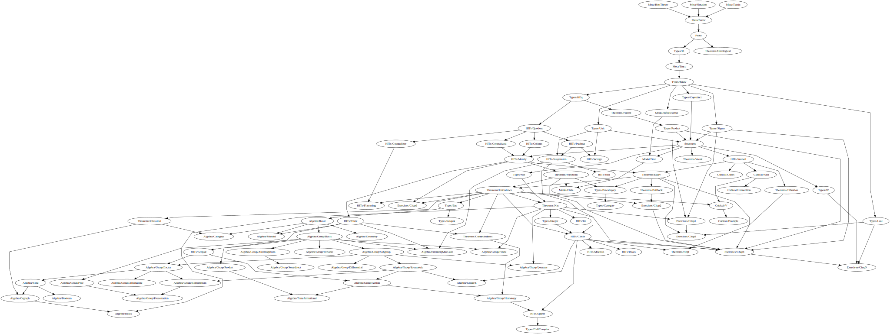

# Ground Zero

This is an attempt to develop Homotopy Type Theory in [Lean 4](https://github.com/leanprover/lean4/).

As in [gebner/hott3](https://github.com/gebner/hott3), no modifications to the Lean kernel are made, because library uses [large eliminator checker](https://github.com/rzrn/ground_zero/blob/master/GroundZero/Meta/HottTheory.lean) ported [from Lean 3](https://github.com/gebner/hott3/blob/master/src/hott/init/meta/support.lean). So stuff like this will print an error:

```lean
hott example {α : Type u} {a b : α} (p q : a = b) : p = q :=
begin cases p; cases q; apply Id.refl end
```

## HITs

[Most HITs in the library](https://github.com/rzrn/lean/tree/master/ground_zero/HITs) constructed using [quotients](https://leanprover.github.io/theorem_proving_in_lean/axioms_and_computation.html#quotients). Quotients in Lean have good computational properties (`Quot.ind` computes), so we can define HITs with them without any other changes in Lean’s kernel.

There are:

* [Interval](https://github.com/rzrn/ground_zero/blob/master/GroundZero/HITs/Interval.lean) $I$.
* [Pushout](https://github.com/rzrn/ground_zero/blob/master/GroundZero/HITs/Pushout.lean) $\alpha \sqcup^\sigma \beta $.
* [Homotopical reals](https://github.com/rzrn/ground_zero/blob/master/GroundZero/HITs/Reals.lean) $R$.
* (Sequential) [colimit](https://github.com/rzrn/ground_zero/blob/master/GroundZero/HITs/Colimit.lean).
* [Generalized circle](https://github.com/rzrn/ground_zero/blob/master/GroundZero/HITs/Generalized.lean) $\{\alpha\}$.
* [Propositional truncation](https://github.com/rzrn/ground_zero/blob/master/GroundZero/HITs/Merely.lean) as a colimit of a following sequence:
  $` \alpha \rightarrow \{\alpha\} \rightarrow \{\{\alpha\}\} \rightarrow \ldots `$
* [Suspension](https://github.com/rzrn/ground_zero/blob/master/GroundZero/HITs/Suspension.lean) $\Sigma \alpha$ is defined as the pushout of the span $\mathbf{1} \leftarrow \alpha \rightarrow \mathbf{1}$.
* [Circle](https://github.com/rzrn/ground_zero/blob/master/GroundZero/HITs/Circle.lean) $S^1$ is the suspension of the bool $\mathbf{2}$.
* Sphere $S^2$ is the suspension of the circle $S^1$.
* [Join](https://github.com/rzrn/ground_zero/blob/master/GroundZero/HITs/Join.lean) $\alpha \ast \beta$.

There are also HITs that cannot be constructed this way. These HITs are defined using standard trick with [private structures](https://github.com/rzrn/ground_zero/blob/master/GroundZero/HITs/Trunc.lean).

## Dependency map



## Related works

* [sinhp/HoTTLean](https://github.com/sinhp/HoTTLean) is a Lean formalization of the groupoid model of homotopy type theory together with a proof mode for developing mathematics synthetically in those type theories.
* [jthulhu/2ltt](https://github.com/jthulhu/2ltt) is a formalization of [2LTT](https://ncatlab.org/nlab/show/two-level+type+theory) in Lean 4.
* [gebner/hott3](https://github.com/gebner/hott3) is a port of the Lean 2 HoTT library to Lean 3.
* [leanprover/lean2/hott](https://github.com/leanprover/lean2/blob/master/hott/hott.md) is an old Lean 2 HoTT library.
* [cmu-phil/Spectral](https://github.com/cmu-phil/Spectral) is a formalization of the Serre spectral sequence in Lean 2.
* [annenkov/two-level](https://github.com/annenkov/two-level) is a Lean 2 formalization of 2LTT.
* [bbentzen/hott-book-in-lean](https://github.com/bbentzen/hott-book-in-lean) is a formalization of the Part I of the HoTT book in Lean 2.

## License

Copyright © 2018–2026 rzrn &lt;rzrngh@outlook.com&gt;

Licensed under the Apache License, Version 2.0 (the “License”);
you may not use this project except in compliance with the License.
You may obtain a copy of the License at

http://www.apache.org/licenses/LICENSE-2.0

Unless required by applicable law or agreed to in writing, software
distributed under the License is distributed on an “AS IS” BASIS,
WITHOUT WARRANTIES OR CONDITIONS OF ANY KIND, either express or implied.
See the License for the specific language governing permissions and
limitations under the License.
